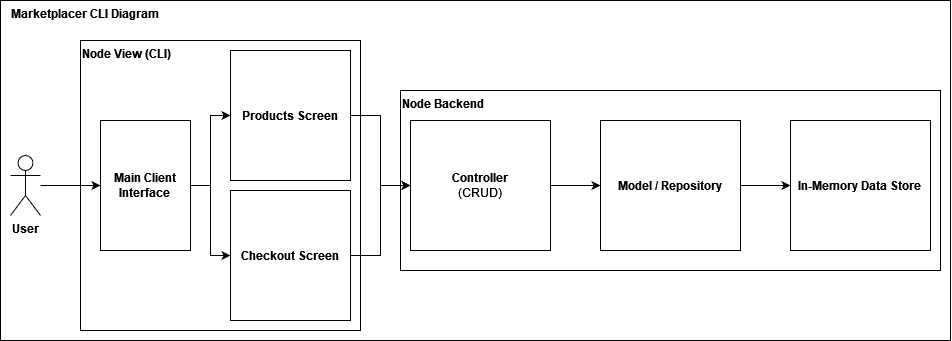

# Marketplacer CLI

CLI application for a simple checkout system using Node.js

## Installation

Run npm install in the root directory to install dependencies

```bash
npm install
```

## Usage
To run the application, run this in the root directory:
```bash
npm start
```
To run unit tests, run this in the root directory:
```bash
npm test
```

## Schemas

### Seeded Products
```javascript
[
  {
    uuid: number,
    name: string,
    price: string
  },
  ...
]
```

### Product Object
```javascript
{
  productId: string,
  name: string,
  price: number
}
```
Product object was designed with a different schema than that of the provided JSON file. Using a string id allows for extensibility, for example when a new requirement is asked to add a new number, a random id generator can be utilized and allows for more unique ids including letters and some special characters. Price is casted as a number to allow for straightforward computations without having to convert again. 

### ProductsList / ShoppingCartData
```javascript
[
  {
    productId: string,
    name: string,
    price: number
  },
  ...
]
```
Having an array allows for aggregated computations and ease of looping.
### ProductsDataObject
```javascript
{
  "productId": {
    productId: string,
    name: string,
    price: number
  },
  ...
}
```
A key-value store separate from the productsList array. It allows for faster querying of a specific product by id instead of iterating through the array to find it. More useful as more products are added to the list.
### Discounts
```javascript
[
  {
    threshold: number,
    discount: number
  },
  ...
]
```
Discount holds both the threshold where the discount is applied if the total price exceeds the corresponding threshold. Expected to be already sorted from highest to lowest threshold for simplicity.

## Design
The CLI application was designed with a monolithic architecture and mostly following a Model-View-Controller pattern. The View encompasses the console inputs and outputs of the user. The controller processes the user input and houses business logic. The Repository handles the data and its structure.



The CLI View is separated into two main components: ProductsScreen and CheckoutScreen. Each screen is responsible for displaying the UI within their specific context. This allows for easier segregation of responsibility between screens. The CLI is kept running by a main function with a while loop and is the one responsible for determining which screen should be displayed or when the application closes by user input.

The Controller and Repository are loosely coupled to allow for modularity and extensibility for each of the two components, and one can be developed independently of the other. Segregation of responsibility is also in play as the Controller is responsible for business logic while the Repository is only concerned with CRUD and GET operations on the data. Dependency Injection is used for the controller instead of importing the repository directly, and the same is done for the view. This ensures only one instance of each component is generated as a singleton, and also allows for mocking of dependencies for more flexible and specific unit tests.

To reduce the complexity of reading console inputs, the ```readline``` library was used to facilitate and process user input in the console. As it is already a built-in module in Node, no additional dependencies are needed for it. Using promises with it also improves readability by eliminating multiple nested callbacks.

Jasmine was chosen as the test framework for the ease of organization with ```describe``` and ```it```.
